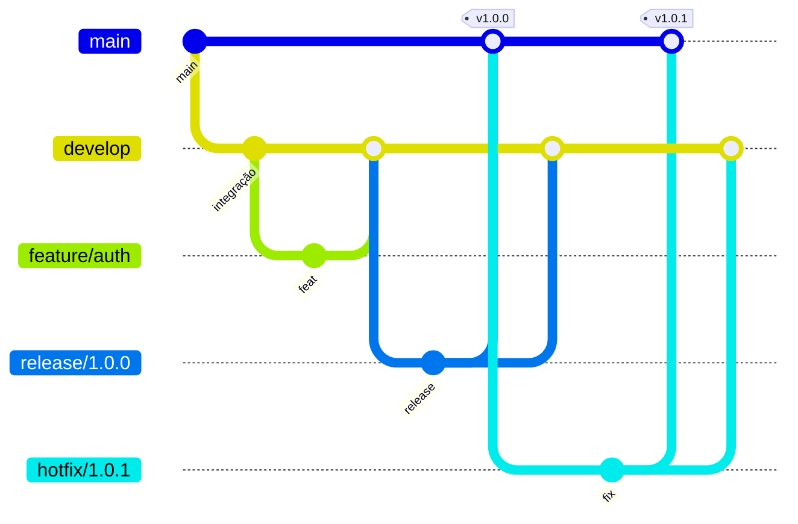

# Contribuir

Guia de branches, commits e qualidade de código para este repositório.

## Git Flow



### Branches

| Branch | Origem | Destino | Uso |
|--------|--------|---------|-----|
| `main` | — | — | Produção; apenas merges de `release/*` ou `hotfix/*` |
| `develop` | `main` | — | Integração contínua; base para features |
| `feature/<slug>` | `develop` | `develop` | Nova funcionalidade |
| `bugfix/<slug>` | `develop` | `develop` | Correção não urgente |
| `hotfix/<slug>` | `main` | `main` + `develop` | Correção urgente em produção |
| `release/<version>` | `develop` | `main` + `develop` | Preparar versão (ex.: `release/1.2.0`) |

### Nomenclatura de branches

Padrão validado pelo hook `pre-push`:

```
main | master | develop
feature/<slug>    → feature/auth-login
bugfix/<slug>     → bugfix/422-validation
hotfix/<slug>     → hotfix/token-expiry
release/<version> → release/1.2.0
```

- `<slug>`: minúsculas, números, hífens, pontos ou underscores (`a-z0-9._-`)
- Evite branches genéricas (`fix`, `test`, `wip`)

### Fluxo típico

```bash
git checkout develop
git pull origin develop
git checkout -b feature/minha-feature

# ... commits ...

git push -u origin feature/minha-feature
# Abrir PR para develop
```

---

## Conventional Commits

Mensagens validadas pelo hook `commit-msg` (`scripts/validate-commit-msg.php`).

### Formato

```
<type>(<scope>): <subject>

[optional body]

[optional footer]
```

### Types

| Type | Quando usar |
|------|-------------|
| `feat` | Nova funcionalidade |
| `fix` | Correção de bug |
| `docs` | Documentação |
| `style` | Formatação (sem mudança lógica) |
| `refactor` | Refactor sem feat/fix |
| `perf` | Melhoria de performance |
| `test` | Testes |
| `build` | Build, dependências |
| `ci` | CI/CD, hooks |
| `chore` | Tarefas auxiliares |
| `revert` | Revert de commit |

### Cursor IDE (botão ✨ Generate Commit Message)

O Cursor **não usa** `.cursor/rules/` para gerar commits. Este repo inclui **`.cursorrules`** na raiz — é o workaround oficial para o botão do Source Control.

Recarrega a janela após alterar `.cursorrules` (`Developer: Reload Window`).

### Auto-formatação (fallback)

Se o Cursor (ou outro cliente) gerar frase solta, o hook `prepare-commit-msg` tenta converter automaticamente antes da validação (`scripts/format-commit-msg.php`).

Exemplo:
```
Add configuration files and enhance contribution guidelines
→ chore(cursor): add configuration files and enhance contribution guidelines
```

### Regras

- Subject em imperativo, minúsculas, sem ponto final
- Máximo 100 caracteres no header
- Scope opcional mas recomendado (`feat(auth):`, `fix(api):`)

### Exemplos

```bash
feat(auth): add refresh token endpoint
fix(user): prevent duplicate email on register
docs(api): document admin user routes
test(acl): cover role permission sync
ci: add quality workflow on pull request
chore(deps): bump hyperf validation
```

### Corpo e footer (opcional)

```
feat(auth): add password reset flow

Implement forgot-password and reset-password with 6-digit code.
Store tokens in Redis when APP_AUTH_RESET_STORE=redis.

Closes #42
BREAKING CHANGE: reset endpoint requires code field
```

---

## Qualidade de código

### Ferramentas

| Ferramenta | Comando | Quando |
|------------|---------|--------|
| PHP-CS-Fixer | `composer lint` / `composer lint:fix` | Estilo PSR-12 |
| PHPStan | `composer analyse` | Análise estática |
| Pest | `composer test:pest` | Testes |
| Tudo | `composer quality` | Antes de abrir PR |

### Git hooks

Instalação (uma vez por clone):

```bash
composer install
composer setup:hooks
```

| Hook | Acção |
|------|-------|
| `pre-commit` | PHP-CS-Fixer nos ficheiros PHP staged |
| `prepare-commit-msg` | Auto-formata mensagens inválidas (ex.: output do Cursor) |
| `commit-msg` | Valida formato Conventional Commits (script PHP) |
| `pre-push` | Valida branch Git Flow + `composer lint` + `composer analyse` + Pest |

Se o `pre-commit` corrigir ficheiros, faça `git add` novamente antes de commitar.

### CI (GitHub Actions)

O workflow `.github/workflows/quality.yml` executa em push/PR para `main`, `master` e `develop`:

- PHP-CS-Fixer (dry-run)
- PHPStan
- Pest
- Validação de Conventional Commits nos commits do PR

---

## Checklist de PR

- [ ] Branch segue Git Flow
- [ ] Commits em Conventional Commits
- [ ] `composer quality` passa localmente
- [ ] Testes adicionados/actualizados quando aplicável
- [ ] `docs/API.md` actualizado se mudou contrato HTTP
- [ ] Sem `.env`, segredos ou credenciais no diff
