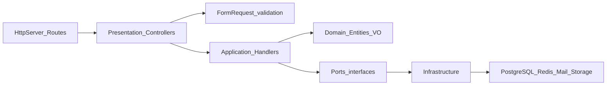

# Estrutura do projeto e regras

Este repositório é uma API **Hyperf 3.x** (PHP ≥ 8.4) organizada em camadas inspiradas em **DDD** e **arquitectura hexagonal**: o domínio e a aplicação definem o comportamento e portas; a infraestrutura fornece adaptadores (base de dados, Redis, mail, HTTP).

A documentação oficial do framework não é substituída por este ficheiro — consulte [hyperf.wiki](https://hyperf.wiki) para comandos, servidor, DI e extensões.

---

## Fluxo de um pedido HTTP

1. `config/routes.php` encaminha o pedido para um método em `app/Presentation/Http/Controllers/`.
2. O Hyperf resolve argumentos; `FormRequest` em `app/Presentation/Http/Requests/` valida entrada.
3. O controller invoca um `*Handler` em `app/Application/` com um `*Command` ou `*Query`.
4. O handler usa o **domínio** (entidades, VOs, regras) e **portas** (interfaces de repositório, token store, mail, etc.).
5. Implementações concretas vivem em `app/Infrastructure/` e são ligadas no container em `config/autoload/dependencies.php`.

---

## Pastas em `app/`

### `Domain/`

- **Responsabilidade:** modelo de negócio puro — entidades, value objects, excepções de domínio, interfaces de repositório e de eventos.
- **Exemplos:** `Domain/User/Entity/User.php`, `Domain/User/ValueObject/UserId.php`, `Domain/User/Repository/UserRepositoryInterface.php`, `Domain/Shared/`.
- **Regra:** código aqui **não** depende de Hyperf concreto, PDO, Redis ou mail — apenas de PHP e das próprias abstracções do domínio.

### `Application/`

- **Responsabilidade:** casos de uso — orquestram o domínio e portas.
- **Padrão:** uma pasta por fluxo com `*Command` ou `*Query` + `*Handler` (por exemplo `Application/Auth/LoginUser/`, `Application/User/RegisterUser/`).
- **Portas:** interfaces como `AccessTokenIssuerInterface`, `PasswordHasherInterface`, stores de reset de password, notifiers, etc., definidas junto da aplicação ou em `Application/Shared/`.
- **Regra:** handlers dependem de **interfaces**, não de classes em `Infrastructure/`.

### `Infrastructure/`

- **Responsabilidade:** adaptadores — persistência, auth (tokens assinados, stores), envio de email, `AuthContext` para o ciclo do pedido, publishers de eventos no-op ou reais.
- **Exemplos:** `Infrastructure/Persistence/User/DbUserRepository.php`, `Infrastructure/Persistence/Project/`, `Infrastructure/Cache/`, `Infrastructure/Queue/`, `Infrastructure/Auth/SignedAccessTokenIssuer.php`, `Infrastructure/Mail/SmtpPasswordResetNotifier.php`.
- **Regra:** implementa interfaces declaradas em `Domain/` ou `Application/`.

### `Presentation/Http/`

- **Controllers:** `Controllers/Admin/` (backoffice com RBAC), `Controllers/Public/` (API pública).
- **Requests:** validação por endpoint (`Requests/Admin/`, `Requests/Public/`).
- **Resources:** transformação de DTOs de aplicação para JSON.
- **Middleware / Exception:** autenticação Bearer, permissões, respostas JSON de erro.

### Contextos de domínio

| Contexto | Domain | Application | Persistência |
|----------|--------|-------------|--------------|
| User | `Domain/User/` | `Application/User/` | `Persistence/User/` |
| Acl | `Domain/Acl/` | `Application/Acl/` | `Persistence/Acl/` |
| Project | `Domain/Project/` | `Application/Project/` | `Persistence/Project/` |
| Page | `Domain/Page/` | `Application/Page/` | `Persistence/Page/` |
| Site | `Domain/Site/` | `Application/Site/` | `Persistence/Site/` |
| Post | `Domain/Post/` | `Application/Post/` | `Persistence/Post/` |

### `Listener/`

- Infra transversal ao ciclo de vida Hyperf: listeners de arranque, filas, etc.

---

## Regras de dependência entre camadas

| Camada | Pode depender de |
|--------|------------------|
| `Domain` | Apenas `Domain` (e PHP) |
| `Application` | `Domain` + interfaces (ports) |
| `Infrastructure` | `Domain`, `Application` (para implementar ports), Hyperf, drivers externos |
| `Presentation` | `Application`, `Domain` (excepções), infra transversal (auth) |

Violações típicas a evitar: `Domain` que importa `Hyperf\Db`; `Application` que instancia `DbUserRepository` em vez de receber `UserRepositoryInterface` por construtor.

---

## Convenções para evolução

1. **Novo caso de uso:** criar pasta em `Application/<Contexto>/<NomeDoCaso>/` com `*Command` ou `*Query` + `*Handler`. Expor dependências via interfaces; registar implementação em `config/autoload/dependencies.php`.
2. **Novo endpoint:** adicionar rota em `config/routes.php`, método no controller, e `FormRequest` se houver corpo ou query a validar.
3. **Novo agregado ou entidade:** começar em `Domain/` com VOs e excepções; só depois repositório e migrações.
4. **Excepções:** distinguir excepções de **domínio** (regras de negócio) de falhas de **aplicação** (credenciais inválidas, etc.) e mapeá-las a códigos HTTP nos controllers ou handlers de excepção.

---

## Testes

- **`test/Unit/`** — testes rápidos de handlers e lógica de aplicação (ex.: `test/Unit/Auth/AuthApplicationTest.php`).
- **`test/Cases/`** — integração HTTP com `Hyperf\Testing\TestCase` (requer extensão Swoole no ambiente de execução).
- Ao alterar comportamento da API, actualizar ou adicionar testes na mesma alteração quando fizer sentido.

---

## ACL / RBAC

- Domínio em `app/Domain/Acl/` (entidade `Role`, repositórios de papéis, permissões e `user_role`).
- Casos de uso em `app/Application/Acl/` (criar papel, sincronizar permissões do papel, sincronizar papéis do utilizador).
- Infra em `app/Infrastructure/Acl/` (`Db*` e `InMemory*` espelhados conforme `APP_USER_REPOSITORY`).
- HTTP: `app/Controller/Admin/RbacController.php`; middleware `RequirePermissionsMiddleware` lê `permissions` nas opções da rota em `config/routes.php`.
- Após autenticação, `AuthenticateMiddleware` carrega as permissões efectivas em `AuthContext`.

## Traduções (i18n)

- Ficheiros por locale em `storage/languages/{locale}/` (ex.: `validation.php`, `http.php`).
- Locale por omissão: `APP_LOCALE=pt_BR` em `.env`; recurso: `APP_FALLBACK_LOCALE=en` (ver `config/autoload/translation.php`).
- Mensagens de validação usam o grupo `validation`; respostas HTTP genéricas usam `http.*` com `trans('http.chave')`.
- A suíte PHPUnit força `APP_LOCALE=en` em `phpunit.xml.dist` para mensagens estáveis nos testes.

## Documentação da API

A referência de rotas, corpos e códigos HTTP está em [docs/API.md](API.md). Ao mudar rotas ou contratos, actualize **API.md** e, se a estrutura ou regras de camadas mudarem, **PROJECT.md** na mesma entrega.
